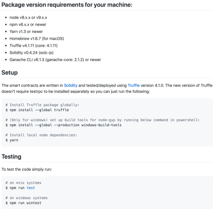
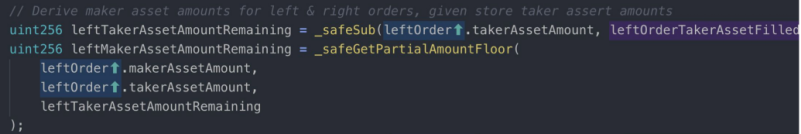
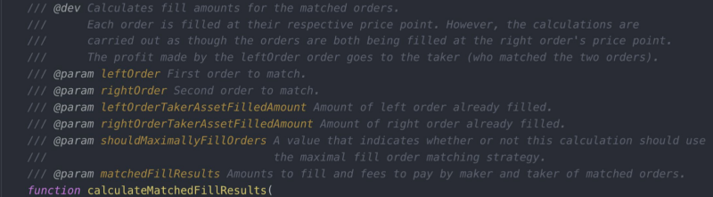

# Auditing process

An audit is:

• An assessment of your secure development process.\
• The best option available to identify subtle vulnerabilities.\
• A systematic method for assessing the quality and security of code.

An opportunity to:

• Learn from experts\
• Identify gaps in your process\
• Identify underspecified areas of your system

An audit can not:

• Replace internal quality assurance\
• Overcome excessive complexity or poor architecture\
• Guarantee no bugs or vulnerabilities

## Auditing Techniques 

It isn't a rule book to follow religiously but it's good to have these things in mind when you feel stuck in a particular project. The actual process of auditing is somewhat personal and you'll probably develop your own as you get more experienced, but here are a few guidelines:

### High-Level Understanding 

The first time you look into code, you don't necessarily need to be analytically looking for bugs or wrong implementations. You should aim to build a good mental model of how the whole system fits together. Unless some particular vulnerability jumps in front of you, don't focus too much on bugs on your first pass, just try and understand the system as a whole.

For this, a good practice is to skim over each file and read functions names and signatures. In most cases, although not always, the interface alone provides a good representation of functionality as well as the entry points of an application. Pay close attention to the inheritance scheme as it helps clarify the relationship between contracts.

### Read the specification. Or not. 

This topic is somewhat controversial. Some auditors do read the provided specification as a first step in an audit, as it helps to understand the intended behavior and save some time reasoning about the contracts. The counter argument is that most specifications are written by the developers themselves, and when you read their intentions, you will develop bias which might blind you to the objective facts of the code.

### The detailed inspection 

There is a multitude of approaches to this. For example, you could look through each `.sol` file individually or you could pick a functionality, say a deposit, and follow its flow, doing a kind of a mental transaction graph. Ideally, you should do both as each provides different kinds of insights.

A good practice is to take some time to actually run the code. Compile it if you can, run tests if they are present or even throw it on remix and use it a little just to get yourself familiar with it.

## Preparing for an Audit

Following these steps to prepare for an audit will go a long way to helping you get the best results.

1. Documentation
2. Clean code
3. Testing
4. Automated Analysis
5. Frozen code
6. Use a checklist

* We have a finite amount of time to audit your code.
* Preparation will help you get the most value from us.
* We must first understand your code, before we can identify subtle vulnerabilities.
* Imagine we’re a new developer hired to join your team, but we only have a few days to ramp up.

### **1. Documentation**

The less time we spend trying to understand your system, the faster we can get deep into your code, and the more time we can spend finding bugs. This is why the number one thing you can do to improve the quality of your audit is provide good documentation.

Good documentation starts with a _plain English_ description of what you are building, and why you are building it. It should do this both for the overall system _and_ for each unique contract within the system.

Another marker of good documentation is that it includes a specification of your system’s intended functionality. For each contract, it should describe the most important properties or behaviors that should be maintained. It should also describe the actions and states that should not be possible.

One of the best examples we’ve seen is the [protocol spec for the 0xProject](https://github.com/0xProject/0x-protocol-specification/blob/master/v2/v2-specification.md#trade-settlement). In particular, their use of flow charts nicely illustrates how the system fits together.

Don’t let me scare you off. Good documentation requires a lot of effort. If you don’t have the capacity to put it together, we can help. Writing our own documentation of the code’s behavior is an excellent way to understand it. It can even lead us to discover vulnerabilities and unexpected edge cases.

**What about a pseudocode spec?** I placed an emphasis on “plain English” above (as opposed to rigid/formal English) because plain English more clearly expresses what you _want_ the code to do. By contrast, the actual code is often so similar to the pseudocode specification that it can be hard to see when they both describe something you do not actually want.

Pseudocode does have its place and can be especially helpful for precisely describing complex mathematics, but it should always be accompanied by some English about what the math is meant to achieve.

The less time we spend trying to understand your system, the more time we can spend finding bugs.

GOOD DOCUMENTATION:

* Describes the overall system and its objectives
* Describes what should not be possible
* Lists which contracts are derived/deployed, and how they interact with one another

Documenting your code will also help you to improve it.

Example of good documentation: [0x Protocol Specifications](https://github.com/0xProject/0x-protocol-specification/blob/master/v2/v2-specification.md)

Example from [Polymath](https://github.com/PolymathNetwork/polymath-core):

### 2. Clean up the code

Polished, well-formatted code is easier to read, which reduces the cognitive overhead needed to review it. A little bit of cleanup will go a long way towards allowing us to focus our energy on finding bugs.

1. Run a linter on your code. Fix any errors or warnings unless you have a good reason not to. For Solidity, we like [Ethlint](https://www.ethlint.com). [Remix](https://remix.ethereum.org) also has a linter integrated at compile time.
2. If the compiler outputs any warnings, address them.
3. Remove any comments that indicate unfinished work (ie. `TODO` or `FIXME`). _(This is assuming it’s your final audit before deploying to mainnet. If not, exercise your judgement about what makes sense to leave in.)_
4. Remove any code that has been commented out.
5. Remove any code you don’t need.

• Add helpful comments: explain the intent, i..e. what are you trying to do

• Using [NatSpec](https://docs.soliditylang.org/en/v0.8.10/natspec-format.html) (natural specification) comments:

• Fix TODOs\
• delete commented out code

### 3. Testing

Write tests! A good goal is a test suite with [100% code coverage](https://en.wikipedia.org/wiki/Code\_coverage).

Review the list of test cases for gaps. Are your tests mostly focused on making sure the the ‘happy path’ works? Write some tests to verify undesirable actions are properly protected against, and that the contract fails properly instead of landing in an undesired state.

**Important:** Your README should give clear instructions for running the test suite. If any dependencies are not packaged with your code (e.g. Truffle), list them and their exact versions.

### 4. Automated Analysis

Ethereum has many good security analysis tools to help find some of the most common issues. We use some of these during our audits, though you can also run them in advance, which will allow us to spend our time looking for trickier bugs.

The [MythX](https://mythx.io) suite, which runs several kinds of analysis at once, is a great place to start. There are many ways to submit your contracts for analysis, including CLI tools for JavaScript and Python as well as plugins for Remix and Truffle. You can find more security tools listed in our [Smart Contract Best Practices](https://consensys.github.io/smart-contract-best-practices/security\_tools/).

It’s not essential to do this, but it helps. A caveat is that you will often get warnings about issues that don’t actually exist.

### 5. Freeze the code

> We can't audit a moving target

An audit is an investment in the security of your smart contract system. Besides selecting a high quality auditor for the work, there are several things you can do to make sure you get the most out of your investment.

At the risk of stating the obvious, you should be done with development of your smart contracts before we audit them.

At the start of our audit, we’ll confirm that you’ve “frozen the code” (i.e. halted development), and we’ll ask for a specific git commit hash to be the target of our audit.

If a change comes in halfway through an audit, it means the auditors wasted time on old code. In addition, the auditors would have to stop and incorporate the change, which can have wide-ranging impacts on things like the threat model and other code that interacts with the changed code.

If your code won’t be ready by the scheduled start date, let us know. It’s better to delay altogether than try to complete an audit while you continue development.

### 6. Use A Checklist

I’ve summarized these steps in a [markdown checklist](https://gist.github.com/maurelian/13831f1940340e0dcd0482555eb5c4fe) that you can copy and paste for use in your own project.

#### Audit prep checklist ([reference](https://diligence.consensys.net/posts/2019/09/how-to-prepare-for-a-smart-contract-audit/))

* [ ] Documentation (A plain english description of what you are building, and why you are building it. Should indicate the actions and states that should and should not be possible)
  * [ ] For the overall system
  * [ ] For each unique contract within the system
* [ ] Clean code
  * [ ] Run a linter (like [EthLint](https://www.ethlint.com))
  * [ ] Fix compiler warnings
  * [ ] Remove TODO and FIXME comments
  * [ ] Delete unused code
* [ ] Testing
  * [ ] README gives clear instructions for running tests
  * [ ] Testing dependencies are packaged with the code OR are listed including versions
* [ ] Automated Analysis
  * [ ] Analysis with [MythX](https://mythx.io)
  * [ ] [Other tools](https://consensys.github.io/smart-contract-best-practices/security\_tools/)
* [ ] Frozen code
  * [ ] Halt development of the contract code
  * [ ] Provide commit hash for the audit to target

## Audit Process and Reporting

### The Audit Process

The audit process varies greatly from company to company, and between individuals as there is, as yet, no generally-accepted industry standard process. We will walk through several activities that take place before, during and after an audit, beginning with foundational points that are generally agreed upon even as we recognize differences of opinion that exist at the practical level.

Definition of audit (Entry 1 of 2)

: a formal examination of an organization's or individual's accounts or financial situation

> The audit showed that the company had misled investors.
>
> The final report of an audit.

: a methodical examination and review

> an energy audit of the house.

So, as you can see, a software audit fits the second definition, - a methodical examination and review.

Before we delve into what smart contract audits are, it might be good to look into the problem audits are meant to address. Smart contract auditing is a niche information security service. It arose out of necessity.

Smart contracts audits aim to prevent the pain entrepreneurs, developers and users experience when Ethereum contracts are hacked or otherwise fail. Such occurrences were fairly common in the early days of Ethereum, as briefly touched upon previously. Immutability implies that repair may be difficult and costly, or impossible. Immutability implies a requirement for debut production releases to be free of defects, but errors and oversights are likely to remain commonplace as new developers enter the space. The EVM is an unfamiliar platform, blockchain is, at first, an unfamiliar paradigm, and Solidity is, at first, an unfamiliar language. It is not reasonable to expect perfection from new developers.

As we saw in a previous chapter, it is not reasonable to expect perfection from the most seasoned and experienced developers, particularly when complex contracts are involved.

When applications actually started being deployed in the mainnet, circa 2016, only a handful of professionals were qualified to perform preventative code review and the practice was generally unknown. Also, knowledge of common vulnerabilities and attack vectors was largely undeveloped. Many serious problems surfaced in many contracts, often resulting in lost funds or malfunctioning systems. In hindsight, these can be understood as avoidable problems. It is fair to say that many defensive code patterns and best practices were learned post-mortem.

Observing projects getting killed by preventable problems increased general awareness of the importance of preventative quality-assurance. Two approaches shaped the formative Ethereum code security industry.

#### Bug Bounties

The first of these is Bug Bounties. Bug bounties are a time-tested approach to reinforcing information security. Organizations such as HackerOne\[^1], organize bug bounties for corporate clients. Bug Bounties are a way of reaching out to large numbers of qualified developers, to possibly discover critical issues. Importantly, Bug Bounties provide incentives to search and discover. After all, why should an accomplished expert devote valuable time and effort to fortify a piece of software if no incentive exists? Software defects in the open can go undetected for a considerable time if no one is incentivized to find them. As history has shown, the expert with the incentive to discover a vulnerability is often incentivized by an intention to exploit a weakness. Bug Bounties alter the balance of incentives. They offer honest experts a reason to search for problems and report findings before weaknesses devolve into incidents in production.

Soon after, companies began reaching out to successful bug hunters and community members known for dexterity around Solidity and the EVM. This is logical, because even if one intends to run a Bug Bounty campaign, one probably doesn’t want to offer bounty hunters low-hanging fruits. A rational actor will want to establish confidence in the code and a low probability of paying out the reward for a critical bug. Confidence enables the possibility of substantial rewards, and substantial rewards is what summons large contingents of talented developers.

Demand for expert code review gave rise to the present-day smart contract audit industry - a handful of specialized Information Security providers focused on Ethereum.

As mentioned earlier, opinions vary and many issues remain unsettled. We offer an opinion of what a smart contract auditing is:

> Auditing a smart contract entails a methodical review of the in-scope source code, in order to provide reasonable assurance that the code behaves as expected, and contains no vulnerabilities.

Reasonable assurance is highlighted because it is impossible to ensure a piece of code contains no bugs. Beware of this when wording reports. Declaring a code base is bug free is irresponsible, and can lead to liability problems. Also keep an eye into how your clients will communicate the audit, and provide clear instructions to them, especially avoiding this type of statement.

It also serves you well to understand why clients engage smart contract auditors. The ostensive reason is to find and correct defects. Naturally, everyone can agree this is a desirable thing to do, even if they disagree on the value of engaging independent third parties to assist with the process.

There is, however, another reason to keep in mind. While largely spoken of in whispers, if at all, smart contract audits help de-risk project-related liabilities. Consider the following.

When a product or service causes accidents, losses, injuries or death it is seldom individual employees who are held accountable. This is because it falls on management to determine if their wares are suitable for purpose. Management may attempt to shift blame to an individual by showing that the individual failed to observe policy or acted incompetently. For example, the company may attempt to avoid blame if accident inspectors blame pilot error or equipment that was certified airworthy by a third party.

In the context of smart contracts, errors and omissions may lead to significant losses (the unhappy trajectory). How can management determine that a system is suitable for purpose?

Who understands smart contracts, other than their developers? Who develops quality-assurance processes? How, then, can management perform their duty to determine that a set of contracts is “ready” and “able?”

An emerging solution to this dilemma is one or more smart contract audits by respected specialists. As mentioned earlier, this does not (cannot) guarantee that no defects exist, but it can indicate that the company and its management acted responsibly by observing the best practices known at the time. In the abstract the trade can be understood as follows:

> The company receives a defense against possible liability. The auditor accepts reputational risk.

For emphasis, auditors should apply care to all forms of communication to avoid a situation in which the auditor appears to take on, perhaps unwittingly, liability for the project.

We will explore bug bounties later in this chapter, and we will go a lot deeper in the auditor career chapter. Let us return to the audit process itself, starting with the first step.

### Code freeze

From a software engineering perspective, a Freeze is a period when the rules that govern changes become more strict. Freezes are used for a variety of reasons. For example a team might implement a Feature Freeze to prevent any new features being added so they can focus on testing, issue resolution, even documentation and marketing collateral. A Specifications Freeze might block further design changes so that implementation of the specification can proceed.

In our case, a Code Freeze is a full code freeze - no changes of any kind while the audit is performed. Smart contract audits are normally performed on repository containing the code, so no commits are permitted during the audit.

This means development is finished. The developers made their best effort to create an application that behaves exactly as specified and contains no bugs.

This is very important. The main reason is obvious: Auditors should look at the version that is going to be deployed. Smart contracts are immutable (we'll get to upgradeability hacks shortly). The audit can be thought of as a dress rehearsal for actual deployment. After deployment, remediation of defects will be either extremely costly or completely impossible. An audit is always about a precise deployment candidate. Future versions of that candidate (if any) must be considered unaudited, since any change is potentially a source of new problems.

The business world applies tremendous pressure on this process. Deadline pressure will invariably push against the ideals of thoroughness and process integrity. As the auditor who accepts reputational risk and endorses the audit finding, your duty is to defend the integrity of the process.

Always request a commit and stick to that during the audit, while also documenting it in the report. Never try to audit a moving target. The effectiveness of your work will be impaired, as will your reputation.

### Specifying intended behaviour

The auditor is tasked with ensuring the application behaves as specified. Where, exactly, is application behavior specified? This will vary greatly from project to project, but ideally there should exist a succinct document outlining the goal of the application, what is allowed and what is prevented. We call this a Statement of Intended Behavior. It should be precise and unambiguous so auditors can compare what the developers want to happen and the code that is intended to make it happen.

A Statement of Intended Behaviour will be presented as a separate document, sometimes as part of the repository's wiki or readme.md. Sometimes the document is simply non-existent. In such a case, request that the developer, along with the rest of his team create a document before the audit starts. Input from business-focused professionals is valuable. Sometimes, they will have a clearer view of how the system should behave.

Let's dive into some examples, starting with a concept familiar to all, a crowdsale. In a crowdsale Statement of Intended Behavior (let us refer to this as “specification” in this context), you will often see:

* Dates (opening, closing, discount periods)
* Price
* Discounts
* KYC requirements (whitelist)
* Access controls (may be static or editable)
* Caps, refunds, etc.

All very familiar, right? They will give you an insight into how the application is supposed to work, and what should be tested during the engagement.

The size of the specification will be proportional to the complexity of the application. To generalize for any application, the specs should include:

* Goal of the application
* Main flows
* The actors / roles and what they do
* Access restrictions
* Failure states to be avoided

One caveat: You will stumble upon specifications that seem to be wrong, and in fact are. If you notice that the owner of the contract can drain the contract of user's funds, it seems obvious that it needs to be reported. But what if the client has specified this as intended behavior?

This is always a tough call, and has been discussed many times such as in A[dam Kolar's article](https://medium.com/solidified/guiding-users-through-the-dangerous-waters-of-smart-contract-security-2f5bee033086) and recently in the [unsolicited audit of Compound Finance's contracts.](https://medium.com/@ameensol/what-you-should-know-before-putting-half-a-million-dai-in-compound-fafdb2645f77)

This raises an interesting question to consider. Who is the audience of the report? Is it the users of the application, or the client who paid for the audit? Again, opinions vary in this formative industry. We, at Extropy feel that audience is the community. Naturally, clients hope for positive reports but the report itself is about the findings of a process. Compromising the process would ultimately reduce the integrity, and value, of the reports. Therefore, such a finding would be documented. If the client resists resolution (more on remedial steps shortly), the issue would remain in the report as an unresolved concern.

When in doubt, document the issue in the report. The whole purpose of our industry is to create systems where trust is not required, or its role is greatly minimized. Try to model the expectations of a user and the client's claims (surprise is an anti-feature). Scale them, and err on the side of caution. The report can and should list what is possibly a concern. That is, what has not been explicitly eliminated, by code, from the scope of possible concerns.

#### Reading List

* [Guiding Users Through The Dangerous Waters Of Smart Contract Security](https://medium.com/solidified/guiding-users-through-the-dangerous-waters-of-smart-contract-security-2f5bee033086)
* [What You Should Know Before Putting Half A Million DAI In Compound](https://medium.com/@ameensol/what-you-should-know-before-putting-half-a-million-dai-in-compound-fafdb2645f77)

## Estimating and price qotes

Although we immediately think of price when we consider quotes, the most important part is estimating the effort it will take to properly secure a set of smart contracts. Even audits that are done for charity (pro-bono) should probably be the topic of some type of estimation process. Remember, even if the work is done pro-bono, reputation is at risk so you can’t afford to compromise the process.

The goal of an estimate is to efficiently assess the key factors that tend to affect actual effort / hours. In this context, “efficiently” means to limit oneself to a superficial perusal of the code that won’t take too long. The key is to know what to look for.

Many companies quote based on lines of code. In our experience, line count (quantity) is a very poor indicator. Complexity is a better indicator of the actual time required for the audit process. A very large, monolithic smart contract will often be easier to audit than a handful of very small smart contracts that interact in multiple ways.

In our experience, good indicators to note include:

* **The count of external calls**: The number of external calls is a good indicator because they impact the code base complexity in a number of ways. When used within the codebase they increase the number of possible paths. When they are calling external, or untrusted contracts then they impact the time you'll spend to review them considerably. Instead of accounting for a known set of methods and being able to verify what are the possible return values, you will have to account for all possibilities.\
  Even simple implementations such as an ERC20 token can have an impact on a calling smart contract: [USDT and OMG tokens do not return true for successful transfers](https://medium.com/coinmonks/missing-return-value-bug-at-least-130-tokens-affected-d67bf08521ca), for example, and are known for not functioning well (usually not being accepted at all) in defi applications. Contracts can be maliciously altered too, so if you are calling untrusted contracts, this has to be accounted for. Recently [SpankChain was hacked and the attacker used a rogue ERC20 token implementation](https://medium.com/spankchain/we-got-spanked-what-we-know-so-far-d5ed3a0f38fe). The rogue contract implemented the ERC20 standard interface, but when called for a transfer would re-enter SpankChain's contract.
* **The count of public / external functions**: These are the points of entry. Execution starts here. They will determine the number of paths possible during execution.
* **Use of Solidity Assembly**: Solidity Assembly takes a lot longer to audit. Code is harder to read, several opcodes that are not accessible via Solidity are at the developer’s disposal and none of Solidity’s usual safeguards apply.
* ****[**Code Smell**](program-analysis/#looking-for-code-smells): (More on this later)
* **Other signs of cleverness, novel solutions**: Anything not idiomatic

Your first estimates will probably be the most challenging for you. It will do you well to review estimated time commitments and actual time spent. This will help you improve your instincts and develop indicators of your own.

When working within a company, you will often not be the person to sell or quote the audits. Certain stakeholders may be tempted to price services below their true cost. Mispricing does not alter in any way the cost side of the transaction. Revenue and cost are separate concerns. Responsible parties should be aware of the risk of an audit compromised by unrealistic time constraints and should understand that your main duty is to safeguard the integrity of the process and everyone’s reputation. You can suggest ways to improve the estimation process if it is ineffective, and your helpful feedback to the stakeholders responsible for quoting can assist your organization’s ongoing improvements to its estimating process.

At Extropy, we request a quote from each of three auditors per engagement and then normalize their estimates. Multiple independent opinions at the outset helps with internal skills transfer around estimation itself and helps us reach informed consensus. Quotes include not only the overall price, but also the time each auditor estimates will be required to personally completely scrutinize the code. The quote is ready when each auditor is comfortable with the time allocated for them to produce uncompromised work.

### When the Client Proposes the Scope

We have described scope in the previous sections, including the necessity of a Code Freeze, the need to properly document Intended Behaviour and the actual commit you reviewed in your report.

Sometimes, the client will propose a project scope that doesn’t fit neatly into your process. For example:

* To audit only certain files in the overall project
* To audit an amended version of something that was audited before, possibly by someone else.\

There are important considerations to keep in mind in these cases.

* **Treat all out-of-scope contracts as untrusted contracts**. This may be counter-intuitive to the client, because they trust them. Again, your duty is to safeguard the integrity of the process and your audit team’s reputation. If you do not review them, treat them (and most importantly, calls to them from the in-scope contracts) as interactions with untrusted contracts.
* **Treat all audits as full audits**. It is not uncommon that clients request a follow-up audit on code that has previously been audited and changed just a bit. If you were not the first auditor, make sure to quote a full audit of the code. It's acceptable to charge a lower price If you did audit a previous version, but make sure to consider the time you'll need to get refamiliarized with the details.\
  Lastly, if you notice important parts of the code base are out of scope, take time to guide your client to understand the risks involved. Remember, clients and readers of your report are depending on you to identify and raise concerns.

#### Reading List

* [Missing Return Value Bug: At Least 130 Tokens Affected](https://medium.com/coinmonks/missing-return-value-bug-at-least-130-tokens-affected-d67bf08521ca)
* [We Got Spanked: What We Know So Far](https://medium.com/spankchain/we-got-spanked-what-we-know-so-far-d5ed3a0f38fe)

## Engagement

### The Engagement

\
We will discuss the technical process in the following modules. Let's first explore high-level processes we know companies utilize so you are prepared to participate in processes used anywhere.

### The Process

Extropy uses a very particular process, that we feel is ideal for auditing smart contracts. All audits include three auditors in the team, with the exception of some very low complexity audits, in which case we allow teams of two.

The auditors are from our community (we hope to see you there soon!), and each provides a quote for the engagement, as previously described. When the client accepts the combined quote and engages the audit team, work commences immediately. The three auditors are tasked with independently completing a complete review of the code - as if three independent auditors were hired to perform the same audit.

We schedule a debrief meeting on delivery day. When the meeting starts everyone opens their reports simultaneously. This process creates healthy competition between the team members, which encourages them to present their best performance. Even so, it's not uncommon that a vulnerability will be found by only two out of three. On occasion, a single auditor finds a vulnerability that was missed by the other two. This is, itself, an advantage of layering independent audits, diverse sets of experience, and uniquely personal work processes.

We do not require the auditors to follow a prescribed process. Auditors are encouraged to audit using the tools they know and trust, inspecting code in the ways that best suit them. This process is an expression of the usual layering process used in risk management and information security. When something is important, you create multiple controls around it. But, you do not create unreasonable layers of control over the same asset. You look for variety, ensuring the sum of the mitigated risk is greater than that of the individual controls.

In that debrief meeting, the reports are merged into the final Extropy report that is delivered to the client.

### Remediation Period

After the report is delivered the project enters a phase in which the client can report fixes that will be verified and documented by the team. The effectiveness of the fixes is verified by the audit team. This is to confirm that the fixes actually work and, importantly, do not create new issues.

The commits in which each issue was fixed are included, as well as a last-reviewed version both in the summary and in the conclusion of the report. Take a look at our reports.

All of our reports are public, to be used by the community. By publishing the reports we also serve users, empower processes such as Nexus Mutual's smart contract cover, and educate both developers and aspiring security professionals. Everyone wins. Admittedly, clients insist on confidential reports. We don’t work on that basis, but we understand our colleagues who do.

### Other Processes

Each company has their own process. As mentioned earlier, processes vary in this formative specialty. The value of an audit is closely linked to the thoroughness of the process and unwavering integrity. Audit reports are meaningless without an understanding of the process that resulted in the report.

We can describe, in general terms, other processes that are known to be practiced.

Most auditors set up a team, including Senior level members (and sometimes Junior) and will have them test part or the whole. Usually, the more experienced team lead will review everything, and will be in charge to make sure nothing is overlooked. A junior auditor position in a reputable company can be a great career path and an opportunity to learn deeply and quickly.

Some companies include automated analysis in their process. And, some companies sell only automated reports (lol). Tools are awesome, but your name is on the line so make sure to use the tools for their intended purpose (assisting you to accomplish the task) and don't rely on them inappropriately. Remember, an automated tool can raise issues it is programmed to detect but they will, generally, fail to grasp Intended Behavior. When false positives are raised it falls on an expert human whose reputation is on the line to determine what is potentially serious and what can be safely dismissed.

Lastly, there are several individuals who provide audit services in the larger Ethereum community, some of them very well regarded.

### After the Audit

We encourage clients to proceed to a bug bounty with significant rewards, as another way to layer mitigation of the risk of bugs and their impact. Some in our industry do not believe bug bounties are effective in securing smart contracts. Our view is a little more nuanced.

* A bug bounty is not a replacement for a meticulous process backed by individuals and an organization with “skin in the game.”
* The effort the community invests in a bug search is driven largely by the size of the bounties. Trivial rewards are unlikely to solicit concerted efforts from strong developers.
* Every live contract is a de facto bug bounty. The main participants operate with inhibited ethical controls, but their skill level should not be underestimated. The incentives correlate with the value entrusted to the contracts.
* It should not be worrisome to post large bounties that will incentivize the ethical community to invest considerable effort in a further search for possible problems. After all, unclaimed bounties cost nothing. Any worry that remains belies uncertainty about the code and the audit process(es) performed. If such worries are significant, that is the conscience’s way of saying release into the real world where other people’s money will be at risk may be an irresponsible thing to do.

In bug bounties, the hunters tend to look for critical bugs, but report whatever they see along the way. They tend to not look over the whole codebase, but they spend time in areas that appear to be high-risk. In combination with an audit, the entire code base is secured by an audit, and the high risk areas are further secured by more eyes and more imagination focused on the code. That’s more experts applying their experience, their imagination and their skills to mitigate the risk that something subtle has gone unnoticed.

#### Reading List

* [Solidified Public Audit Reports](https://github.com/solidified-platform/audits)

## Audit Report

The Audit Report\
The Audit Report is the deliverable of the engagement. As such, it's important that it includes defined sections and communicates the project completely. These are the normalized section headings of a Extropy Audit Report:

* Identification of the client
* Date
* Scope (list all files)
* Commit hash and repository address
* Bugs
* Conclusion

Document who requested the audit. It’s acceptable if the client requested anonymity. Your report should indicate this explicitly. Also document the date the audit was published, the files reviewed, bugs and concerns discovered and an overall conclusion about the health of the application.

Your writing style should address diverse audiences. For example, the client might be a Venture Capitalist with limited understanding of the technical details. The report may also appear in the public domain (as do all Extropy Audit Reports) and it might be read by end-users considering participation. Finally, it is a foregone conclusion that developers will be interested in technical explanations of bug reports. It is therefore important to make the issues and the overall sentiment clear for a non-technical audience, supported by unambiguous technical explanations of the issues and sentiment described.

Not all Audit Reports are prepared for such diverse audiences. If delivering to developers on a confidential basis, it may be acceptable to be less didactic while ensuring that bugs are clearly and concisely described and that the introduction and conclusion can be understood by the average ethereum user (a technically literate user).

In particular, be sure to describe the potential impact (why it matters) in terms that are understandable by the widest possible audience, and explanations in terms a developer can parse to comprehend the precise nature of the bug without further explanation.

### Reporting Bugs

Bug reports are the main product of both audits and bug hunts. A bug report is only as good as the understanding it provokes in the mind of the receiver. The central task of a bug report is to make the issue crystal clear to other people.

Also keep in mind that the audience of a bug report is often the very people who either wrote the code or audited it. They have looked at it from many angles (perhaps not all angles!) and your task is to change their minds about something they thought was correct. Explain in a matter-of-fact, non-accusatory tone and include sufficient information to support your claims.

Clearly describe the problem, the consequences, steps to get there, impact, severity and optionally a suggested direction for the fix.

Keep in mind that bugs are subjective. Indeed, considerable controversy can swirl around exactly what is and what is not a bug. For example, under certain conditions that probably cannot possibly exist, something terrible could happen. Or, under everyday conditions, something odd can happen but it is of no serious consequence.

We will dive deep into bug categories and severity classifications shortly. For now, let's focus on the central point, which is that a bug report should describe the discovery with completeness and precision.

Some good examples:

[The ERC20 Approval Attack](https://docs.google.com/document/d/1YLPtQxZu1UAvO9cZ1O2RPXBbT0mooh4DYKjA\_jp-RLM/edit):

This is how the original ERC20 approval attack was described. Although the format is unusual, it has everything that a well-described bug should have: the context, the steps to the exploit, a brief analysis and a possible workaround.

[CryptoKitties empty fallback](https://github.com/dapperlabs/cryptokitties-bounty/issues/3):

This was found by Nick Johnson during the initial crypto kitties bug bounty. It follows a format more likely to be found in bug bounty and audit reports with concise explanation and consequences.

#### Reading List

* [ERC20 Approval Attack](https://docs.google.com/document/d/1YLPtQxZu1UAvO9cZ1O2RPXBbT0mooh4DYKjA\_jp-RLM/edit)
* [CryptoKitties Bounty Issue 3](https://github.com/dapperlabs/cryptokitties-bounty/issues/3)

## Categorization of Severity

Risk ratings, as well as the processes we've just seen, vary greatly between organizations. Each company will have its own way to classify bugs. Even when the familiar categories of critical, major, and minor are used, the definitions of what’s included are inconsistent between firms.

This is another example of organizations in the space working independently on their own processes in a standards-free setting. When one finds a bug, it’s important to categorize it properly, according to the local customs of the audit team or bug bounty program.

While it may be tempting to subjectively stamp a discovered bug as Critical (because it’s serious), always review the bug bounty or company procedure / standard to ensure you do not categorize incorrectly. Remember, your bug can and will be refuted if it’s classified the wrong way so you need to be prepared to defend your classification of the bug as well as your description of the bug.

> You need to be prepared to defend your classification of the bug as well as your description of the bug.

Several industry standards (in the wider security industry, not smart contract audits) address the topic. The most prominent of these is the OWASP (Open Web Application Security Project) risk classification standard, which is used by the Ethereum Foundation and many others. Another is the CVSS (Common Vulnerability Scoring System), created and mostly maintained by NIAC, a United States council that includes members from the American industry, infamous now after several members resigned once the US Government recently revoked funding to the council.

### OWASP

Let's take a closer at the OWASP risk classification standard, because it's the most widely used in open source projects, and it's also the one you'll most likely see when participating in bug bounties.

When one classifies a bug as “critical”, one is saying the risk related to the bug is very high, but what, exactly, is risk?

#### Risk

Risk is a familiar term to everyone. Humans weigh risks in our daily lives with almost every action we take (or do not take). Think, for a moment, of how you quickly assess the situation in order to cross a street. These assessments are made almost instinctively, and risk-assessment of any given situation varies from one individual to the next. We have all met someone who takes risks we would not take (for their betterment or to their detriment). We have all met someone who regularly shies away from actions we perceive to be low-risk.

We can approximate these differences of opinion as different estimates of probability and different estimates of consequences.

But, if everyone's assessments are different (the term for this is risk appetite - the amount of risk one accepts in order to achieve a goal), doesn’t that mean that perceived risk is subjective? How can we objectively describe the risk of a given vulnerability?

Let's first properly define risk.

### Risk = Likelihood \* Impact

Risk equals the Likelihood of something materializing (or, in our case, the likelihood of the bug being exploited) times the Impact caused when it happens. This formulation is pervasive. It applies to everyone assessing risk across all domains. It applies to investment portfolios, regulatory compliance, smoke detectors and yes, even crossing the street. As you might have guessed, it applies to bugs in smart contracts.

With this understanding in mind, let's look at how OWASP breaks down likelihood and impact, making a previously purely interpretative assessment more objective.

### Likelihood

OWASP breaks likelihood into two sub-dimensions, with four items each. The final score is usually a simple average of all the values. The factors are:

#### Threat Agent Factors

Threat agent is the possible attacker. The goal here is to estimate the likelihood of a successful attack by this group of threat agents. Use the worst-case threat agent.

#### Skill level

* **Skills**: How technically skilled is this group of threat agents? No technical skills (1), some technical skills (3), advanced computer user (5), network and programming skills (6), security penetration skills (9)
* **Motive**: How motivated is this group of threat agents to find and exploit this vulnerability? Low or no reward (1), possible reward (4), high reward (9)
* **Opportunity**: What resources and opportunities are required for this group of threat agents to find and exploit this vulnerability? Full access or expensive resources required (0), special access or resources required (4), some access or resources required (7), no access or resources required (9)
* **Size**: How large is this group of threat agents? Developers (2), system administrators (2), intranet users (4), partners (5), authenticated users (6), anonymous Internet users (9)\

#### Vulnerability Factors

The next set of factors are related to the vulnerability involved. The goal here is to estimate the likelihood of the particular vulnerability involved being discovered and exploited. Assume the threat agent selected above.

* Ease of discovery: How easy is it for this group of threat agents to discover this vulnerability? Practically impossible (1), difficult (3), easy (7), automated tools available (9)
* Ease of exploit: How easy is it for this group of threat agents to actually exploit this vulnerability? Theoretical (1), difficult (3), easy (5), automated tools available (9)
* Awareness: How well-known is this vulnerability to this group of threat agents? Unknown (1), hidden (4), obvious (6), public knowledge (9)
* Intrusion detection: How likely is an exploit to be detected? Active detection in application (1), logged and reviewed (3), logged without review (8), not logged (9)

### Impact

Impact is usually measured in financial terms, in OWASP's case it also derives from a number of factors:

Technical Impact Factors\
Technical impact can be broken down into factors aligned with the traditional security areas of concern: confidentiality, integrity, availability, and accountability. The goal is to estimate the magnitude of the impact on the system if the vulnerability were to be exploited.

* Loss of confidentiality: How much data could be disclosed and how sensitive is it? Minimal non-sensitive data disclosed (2), minimal critical data disclosed (6), extensive non-sensitive data disclosed (6), extensive critical data disclosed (7), all data disclosed (9)
* Loss of integrity: How much data could be corrupted and how damaged would it be? Minimal slightly corrupt data (1), minimal seriously corrupt data (3), extensive slightly corrupt data (5), extensive seriously corrupt data (7), all data totally corrupt (9)
* Loss of availability: How much service could be lost and how vital is it? Minimal secondary services interrupted (1), minimal primary services interrupted (5), extensive secondary services interrupted (5), extensive primary services interrupted (7), all services completely lost (9)
* Loss of accountability: Are the threat agents' actions traceable to an individual? Fully traceable (1), possibly traceable (7), completely anonymous (9)\
  Example:

#### Business Impact Factors

The business impact stems from the technical impact, but requires a deep understanding of what is important to the company running the application. In general, you should be aiming to support your risks with business impact. The business risk is what justifies investment in fixing security problems.

Many companies have an asset classification guide and / or a business impact reference to help formalize what is important to their business. These standards can help you focus on what's truly important for security. If these aren't available, then it is necessary to consult with people who understand the business to get their take on what's important.

The factors below are common areas for many businesses, but this area is even more unique to a company than the factors related to threat agent, vulnerability, and technical impact.

* **Financial damage**: How much financial damage will result from an exploit? Less than the cost to fix the vulnerability (1), minor effect on annual profit (3), significant effect on annual profit (7), bankruptcy (9)
* **Reputation damage**: Would an exploit result in reputation damage that would harm the business? Minimal damage (1), Loss of major accounts (4), loss of goodwill (5), brand damage (9)
* **Non-compliance**: How much exposure does non-compliance introduce? Minor violation (2), clear violation (5), high profile violation (7)
* **Privacy violation**: How much personally identifiable information could be disclosed? One individual (3), hundreds of people (5), thousands of people (7), millions of people (9)

We combine Severity and Impact to get to the severity of the Risk:

.png>)

Using the example tables above, the issue would fall into High risk bug. Keep in mind that business impact is hard to measure without knowing details about the client, so technical factors usually prevail. OWASP provides a [nice spreadsheet](https://www.owasp.org/index.php/File:OWASP\_Risk\_Rating\_Template\_Example.xlsx) so we don't have to reinvent the wheel.

Although OWASP's model is the industry standard, when we look at our niche (Ethereum smart contracts), we'll find simpler models. At Extropy we encourage that, as simpler models make everyone's lives easier. Removing information that is less relevant when dealing with smart contracts creates focus on what is especially important.

With simpler models, it is still important to clearly outline what is included in each severity category, in order to remove doubt and subjective interpretation. The model below is very simple, but can be applied to most smart-contract-only bug bounties:

* Critical: Stealing user funds, freezing funds in the smart contracts.
* Major: A user obtains advantage over others in an unintended way.
* Minor: Bugs that can cause friction to users, but put no funds at risk and create no unfair advantages for particular users.

It is important to observe the classification standards of the organization or platform you are working with. Always review the rules before setting the category assessment because incorrect classification may lead to your report (and your bounty claim) being rejected. Remember to gather evidence supporting your report.

#### Reading List

[OWASP Risk Rating Template](https://www.owasp.org/index.php/File:OWASP\_Risk\_Rating\_Template\_Example.xlsx)

## Conclusion 

You are most likely familiar with bug bounties by now. Basically, they are business processes in which companies pay for bugs found in their codebase. Bugs have different rewards, with critical bugs typically paying large amounts in order to attract bug hunters to explore into the code.

Each such platform has unique quirks, so always take a look before reporting a bug you found. For example, publicizing a critical bug before submitting a confidential disclosure can make you ineligible to receive the reward. This is sensible because public disclosure of software defects can cause unnecessary damage by denying the bounty sponsor the opportunity to fix the bug. Always review what they want you to do. Your aim should be to establish that you have followed the correct process.

Some programs require an issue open at the company's github. Some are just emails. At Solidified, all you have to do is post the bug.

### Formal Verification 

Formal verification is the process by which one proves properties of a system mathematically. In order to do that one writes a formal specification of the application behavior. The formal specification is analogous to our Statement of Intended Behavior, but it is written in a machine-readable language. The formal specification is later proved (or not) using one of the available tools.

The process is widely used by the hardware industry, and also by industries that produce systems in fields such as flight controls, space flight and life-support where they routinely deal with high risk (non-trivial Likelihood of a defect in a complex system \* catastrophic Impact). Think about the operating system for a nuclear power station.

Formal verification is out of the scope of this course (there are large books on the subject), but we should understand what it is, how it works, and its limitations, at a high level.

Formal verification is a trendy topic in the blockchain world. It is natural that the community would relate smart contracts to the aforementioned industries. Formal verification is not, however, a silver bullet, or a substitute for a good audit. Also in the aforementioned industries, an audit is frequently conducted, including not only on the code base, but also on the formal verification specification itself. Flaws in this specification will mean that some of the properties of the application are not actually proven in the end, with bugs possibly going unnoticed.

Formal verification requires segregation of duties, in order to be effective. If the writer of the specifications is the coder of the application, the effectiveness of formal verification is greatly reduced.

Lastly, in our industry, due to the rough state of the tooling, formal verification processes are costly and lengthy. That is likely to change as more people include it in their development processes.

### How Will They all Fit Together? 

The best processes will mix and layer all everything discussed above. A multifaceted approach greatly increases the probability of finding a bug, if one exists.

A recent example is MakerDAO's Multi Collateral DAI set of smart contracts. Most of the smart contracts were formally verified and an audit was conducted. This was the start of an excellent process. Even so, a USD $50,000 critical bug was awarded by their Bug Bounty program, demonstrating the value of a Bug Bounty even after audits and formal verification.

The process we recommend is an audit, or audits (three independent auditors), followed by a well-funded bug bounty that is open for sufficient time to build confidence in the project and with significant rewards for finding critical bugs.

## Summary 

When auditing, the patterns outlined in the module should be used as a guide. Other designs are of course welcome, if secure, but these best practices are standards for a reason. Departures from these patterns should be supported by reasons that outweigh the benefits of using these common patterns.

Each of the patterns also brings its share of risk to the table, and these risks have to be thoroughly evaluated by the auditor. Keep the pitfalls in mind!

Also pay attention to items that seem out of place. A variable declared at the very end of a contract might be there for an obscure reason, as are very complex calculations or overly complex external calls. This is something an auditor learns over time with experience: generally if some piece of code seems unusual it deserves a careful look (and will often lead to issues).

## Resources

* [Missing return value bug](https://medium.com/coinmonks/missing-return-value-bug-at-least-130-tokens-affected-d67bf08521ca)
* [What should you know before putting half a million DAI in compound](https://medium.com/@ameensol/what-you-should-know-before-putting-half-a-million-dai-in-compound-fafdb2645f77)
* [Collusion](https://vitalik.ca/general/2019/04/03/collusion.html)
* [A closer look at Ethereum Signatures](https://hackernoon.com/a-closer-look-at-ethereum-signatures-5784c14abecc)
* [What is the math behind elliptic curve cryptography](https://hackernoon.com/what-is-the-math-behind-elliptic-curve-cryptography-f61b25253da3)
* [How not to use ECDSA](https://yondon.blog/2019/01/01/how-not-to-use-ecdsa/)
* [The-complement of `s` when `s` curve order](https://bitcoin.stackexchange.com/questions/38252/the-complement-of-s-when-s-curve-order-2/38253#38253)
* [https://blog.smartdec.net/smartdec-smart-contract-audit-beginners-guide-d04cc7f1c571](https://blog.smartdec.net/smartdec-smart-contract-audit-beginners-guide-d04cc7f1c571)
* [https://consensys.net/diligence/blog/2019/09/how-to-prepare-for-a-smart-contract-audit/](https://consensys.net/diligence/blog/2019/09/how-to-prepare-for-a-smart-contract-audit/)
