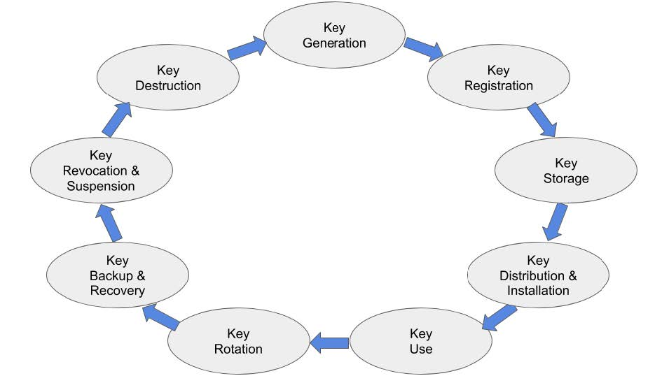
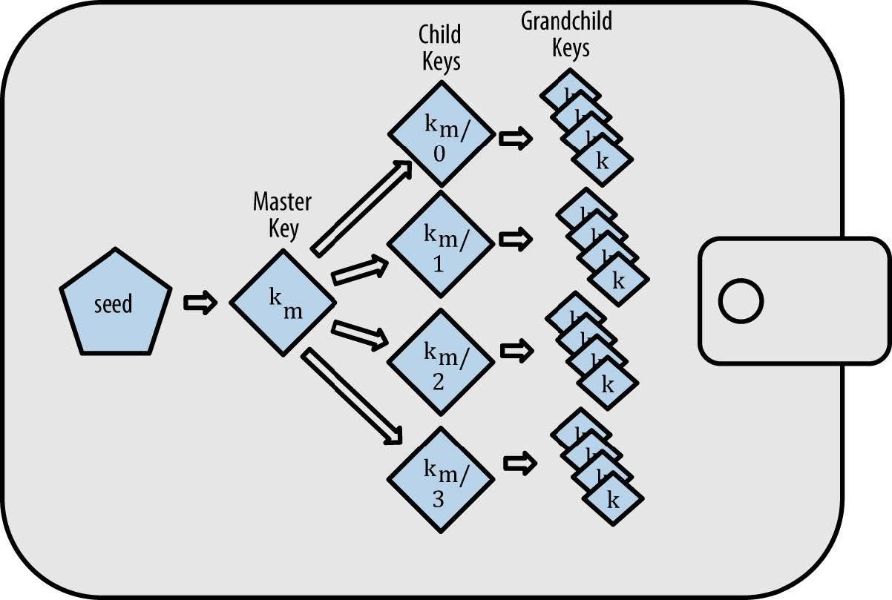

# Key Management

## Introduction

Key management is a well-established practice in the IT world, this practice is composed of a set of sequential phases that cryptographic keys have to go through from the moment they are generated to when they are revoked. Cryptographic keys are used for all sorts of purposes in the modern internet, from signing website certificates, to encrypting communication information.

Nowadays key management systems rely mostly on centralized infrastructure, for example DNS for Certificate Authority, the IMAP protocol for accessing email remotely, and pretty much every other service on the internet. During our research, we have identified two properties of blockchains that are particularly beneficial for key management systems; security and transparency.

## Security

One common example of where security fails in a centralized key management infrastructure is Windows Active Directory, this system is used in enterprise environments for storing passwords/keys and managing access controls across the whole enterprise. It represents a treasure chest for hackers (or system administrators) and is often as vulnerable as the weakest link in the system.

In a blockchain system the users’ identity can be stored on a public, immutable database without revealing any private information. This identity in the form of a cryptographic public key is then used for both authentication and authorization tasks.

## Transparency

Probably the biggest advantage of using blockchains as databases is the end-to-end transparency of information that they store; this wouldn’t be possible if it wasn’t for the blockchain’s immutability property which guarantees the integrity of the information.

Transparency enables every user of the system to independently authenticate themselves to any other user, program (smart contract), or web application on the internet.

## **Key** **Management** **Lifecycle**

This section attempts to give an overview of a generic key-management system, by describing and comparing how each phase works for both centralized and decentralized systems.

The typical phases of a key management lifecycle are shown in the picture below:

### 1. Key Generation

In a public blockchain system, keys are generated independently by whomever wishes to participate interact with the blockchain; a (ECDSA) key pair is created locally, by a smartphone or the hardware module of a connected car.

Keys such as the ones used to manage an organization’s proxy identity can be created using a hardware security module (HSM) or a multi-signature wallet, and sensitive functionality can be set to require n of m of those signatures in order to be executed by the smart contract. For example, two or more management level signatures may be required in order to transfer a non-fungible car token from a dealership or fleet management identity contract.

Another option for generating keys is to deterministically derive them from a root seed. This seed, a 256-bit random number which can be derived from a mnemonic phrase, i.e. it is possible to generate

millions of public/private key pairs from a single mnemonic which can also be used to restore them all should the HD wallet get lost for example. The following diagram illustrates this concept of a ‘hierarchical deterministic wallet’:

For detailed information on Ethereum wallets and key generation [see here](ttps://github.com/ethereumbook/ethereumbook/blob/develop/05wallets.asciidoc).

### 2. Key Registration

During this phase, centralized systems typically register keying material and any information or attributes associated with a particular entity, along with authorization information. In public blockchains however, anyone can participate without registering their addresses to a centralized server.

The difference lies in the fact that in blockchains, authorization is enforced by smart contracts, as described in [ERC-725](broken-reference) I.e. keys must registered/added to the identity smart contract, and upon registration the identity owner will decide what “purpose” this key has in terms of access controls.

If a proxy identity is owned by an individual, the deploying key will become the owner of the identity proxy. However, if the proxy identity is owned by an entity such as a corporation, individuals will generate their keys locally and subsequently request to be added the entity’s smart contract in order to perform specific actions on its behalf (signing, encryption, execution..). Those keys will need to be approved before they can be registered with a specific clearance level, this process can be done

manually or automated by verifying specific attributes (claims issued by trusted third parties or self) that the keys already hold.

### 3. Distribution and Installation

As described in the previous section, key distribution is typical of centralized key management systems, where keys are generated centrally and distributed by safe means to the users of the system. In a blockchain system, although keys can be generated offline, it is usually the case that the blockchain client or user wallet has some key generation and storage capability, both these features will be included in a smartphone app or come preinstalled on some IoT hardware as could be the one mounted on a car.

### 4. Backup and Storage

Keys are saved in encrypted form on the generating device, protected by a user’s password or biometrics such as fingerprint or facial recognition.

Backup can be done on other trusted devices owned by the user or stored (encrypted) on a cloud server, and usually involves backing-up a seed phrase rather than the key itself.

### 5. Key Use

Just like in a centralized system, different types of keys exist which require a different level of security and have very different lifespans. For example, symmetric encryption keys may be required to be stored indefinitely, whereas asymmetric encryption such as those used for securing TLS connections keys are generated and destroyed for each new connection.

On Ethereum, for most key management purposes a normal ECDSA key pair is all that’s needed for both authentication and authorization. In contrast, a centralized architecture will usually store dozens of different cryptographic key types for each user, each used access to specific services; most of those keys will only be valid for a single use.

### 6. Key Recovery

This is perhaps the only phase where blockchain falls short, the reason being that the security of keys is left in the hands of their users. In a centralized system, it is much easier to recover a forgotten password, often as simple as sending a recovery email.

In blockchain, if a key is lost and it (the seed) hasn’t been backed-up, then it is gone forever, and so are any cryptocurrency that the key owned.

Recovering keys using a mnemonic seed phrase has already been described, other popular approaches include:

1.
   1.
      * **Multiple** **owners** – MultiSig wallets allow for setting a number of owners n. If fewer than n owners are required, the remaining owners could replace an owner in case they lose access.
      * **Social** **recovery** – users could determine a group of friends that are enabled to recover access to their account on their behalf (i.e. each of them holds a piece of the signature that, combined together, would grant access to the account). Only when all friends agree, the account owner is replaced.
      * **KYC** **procedures** – similar to how modern banks perform KYC procedures on new customers, users could identify themselves to KYC providers in order to regain access to their funds.
      * **Paralysis** **proof**: this new concept is also known as time lock recovery and last resort recovery. In case access to an account is lost, it can be marked as such. Also, the person marking it as lost may put in a deposit. Now a time period starts after which the account is replaced. During that time period the actual account owner could prove that the account is actually not lost by making a transaction. If so, the attacker loses the deposit which is transferred to the account.

### 7. Key Revocation

Revoking a key is a matter of removing it from the “keychain” of a proxy identity, this can be done by any management key or the owner(s) of the smart contract. Once a key is removed, it will not have access again to any of the proxy identity’s functionality (sign, execute, ...).

A key advantage is also that by removing a signing key from a proxy identity, one instantaneously invalidates also any claim or statement made by that key on behalf of the issuing identity. If a signing key was compromised for example, it would really easy to undo anything that key may have signed in the past. Now compare this with a centralized database scenario where, due to breach, thousands or more users’ passwords and PII may be compromised at once; one cannot revoke a stolen password. By using smart contracts on the other hand, should a key get stolen, it could immediately get invalidated by any other management or owner key.
