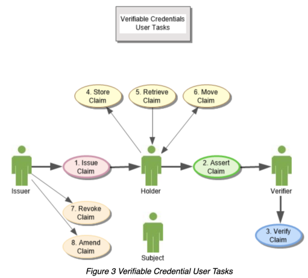
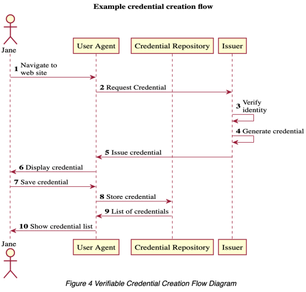
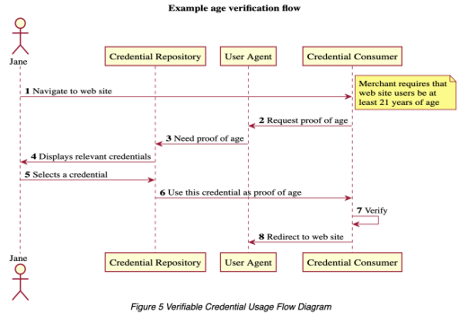

# DIDs

## Introduction

Decentralized Identities\(DIDs\): DIDs are fully under the control of the DID subject, independent from any centralized registry, identity provider, or certificate authority.

"Decentralized identities are anchored by blockchain IDs linked to zero-trust datastores that are universally discoverable”.

### Blockchain IDs

Gaining trust not from central authorities, but rather from inter-connected, yet fully decentralized networks of people, all choosing to participate in a Web of Trust.

## Verifiable Claims







## Zero-trust datastores

A zero-trust datastore encompasses the ability to store private information locally, while maintaining trust and authenticity globally.

Using decentralized constructs, like an Ethereum Claims Registries, alongside the uPort SimpleSigner libraries, it’s possible to store encrypted data on a smartphone and pass that information back to servers and applications without losing trust in its authenticity. Save information locally. Share data globally. No middleman required.

Ethereum Claims Registry — Public Keys

The uPort team recently published \(2018\): • ERC780 EIP - ERC: Ethereum Claims Registry \#780 ◇ The Ethereum Claims Registry serve as the public registry for trust anchors. Allowing distributed applications to publicly save/register a public key. • ERC1056 EIP - ERC: Lightweight Identity \#1056

### Why is a public claims registry important?

Because distributed applications use the complimentary private signing key to generate attestations. When another application requests the privately signed information, from a private environment \(smartphone/userspace\) they need authenticate the information.

To verify the source of the signed information, it’s essential anyone can lookup the corresponding public key i.e. via the Ethereum Claims Registry using a decentralized identity resolver.

## 

## Self-sovrreign ID vs ID on blockchain

Identity unlocks formal services as diverse as voting, financial account ownership, loan applications, business registration, land titling, social protection payments, and school enrollment.

### Identity problems

* First, despite progress in some areas of the world, many people still lack formal identification.
  * Functional IDs: any given person may have a variety of functional IDs \(e.g., driver’s license, health insurance card, voter registration card\).
* The centralization of personal data in DID databases can increase privacy threats.

### Trends

* Advances in biometrics 
* Blockchain ID
  * Many proposed blockchain-backed ID systems are examples of “accretionary ID,” where an ID is built up over time through a series of interactions with others
  * Other blockchain ID applications simply use a blockchain ledger as the back-end database for a more traditional ID system. This may improve ransparency, but the differences will likely be invisible to typical users.
* User-controlled ID \(self-sovreign\)
  * In contrast to systems where institutions provide ID credentials, user-controlled IDs build on the premise that people will control the formalization of their identity.

### Blockchain-Backed ID

#### What is it? Blockchain-backed ID can refer to:

* An accretionary ID, where an identity is built up over time through a series of transactions stored on a blockchain and verified by others
* Use of a blockchain-based distributed ledger platform as the back-end database for a more traditional ID system
* Use of a blockchain-based distributed ledger platform to log transactions linked to a previously established identity Example use cases
* Economic ID: Provides a permanent, accessible record of transaction history
* Humanitarian cash transfers: Eliminates opportunities to falsely claim assets to which someone else is entitled
* Land titling: Securely maintains important records What problems can it solve?
* Resilience: Blockchain records are permanent and accessible from any participating node, offering protection from destruction and loss
* Persistence: Blockchain records are very difficult to alter; this protects data integrity
* Corruptibility of Centralized Authority: Democratizing reading and writing to database bypasses role of institutions What problems does it NOT solve?
* Data Validity: Any documents or assets stored using blockchain need to be verified through other means; the integrity of the data is only protected after it is entered

### User-Controlled ID What is it?

* An approach rather than one technology • Increases individual control over identity information, management, and sharing Example use cases
* DigiLocker, Yoti, Sovrin and Hyperledger Indy What problems can it solve?
* Allows users to share only data needed and no more, better preserving privacy
* What problems does it NOT solve?
* Requires high levels of digital literacy and ability to manage personal data
* Policy/regulatory environment may not provide sufficient protections for users \(e.g., clear definitions of data ownership, means of recourse in the case of data loss or breach\)
* Clear standards to judge the reliability of a self-asserted ID in terms similar to institutionally granted IDs What problems could it create?
* Significant and poorly understood dependencies \(e.g., digital infrastructure, digital literacy\)
* Inefficient or ineffective investment in a premature technology solution
* What is current state of play?
* There are several apps that incorporate elements of user-controlled systems catering to high-income contexts, generally very early stages
* To our knowledge, there are no examples of fully user-controlled systems to date

## DID Methods

[https://w3c-ccg.github.io/did-method-registry/](https://w3c-ccg.github.io/did-method-registry/)

1. The Registration Process Software implementers may find that the existing Decentralized Identifier Methods listed in this repository are not suitable for their use case and may need to add a new method to this registry. Adding a Decentralized Identifier Method to this list is designed to be a lightweight, community-driven process. In order to add a new method to this registry, an implementer MUST: 1. Implement at least an experimental version of the new DID Method. 2. Create a specification describing the new DID Method that is publicly available and intended to be conformant with the DID specification at [https://w3c-ccg.github.io/did-spec/](https://w3c-ccg.github.io/did-spec/). Ensure that the title in the specification contains a version number. 3. Request that the specification be added to this registry by submitting a Github Pull Request that adds the new method to the list of existing methods, with URL. Specifications that do not meet these criteria will not be accepted. Old listings which fall out of conformance may be removed. Implementers that would like help or guidance during this process are urged to join the W3C Credentials Community Group and request assistance via the mailing list.
2. The Registry This table summarizes the DID method specifications currently in development. The links will be updated as subsequent Implementer’s Drafts are produced.

```text

Method Name 	Status 	DLT or Network 	Authors 	Link
did:abt: 	PROVISIONAL 	ABT Network 	ArcBlock 	ABT DID Method
did:btcr: 	PROVISIONAL 	Bitcoin 	Christopher Allen, Ryan Grant, Kim Hamilton Duffy 	BTCR DID Method
did:stack: 	PROVISIONAL 	Bitcoin 	Jude Nelson 	Blockstack DID Method
did:erc725: 	PROVISIONAL 	Ethereum 	Markus Sabadello, Fabian Vogelsteller, Peter Kolarov 	erc725 DID Method
did:example: 	PROVISIONAL 	DID Specification 	W3C Credentials Community Group 	DID Specification
did:ipid: 	PROVISIONAL 	IPFS 	TranSendX 	IPID DID method
did:life: 	PROVISIONAL 	RChain 	lifeID Foundation 	lifeID DID Method
did:sov: 	PROVISIONAL 	Sovrin 	Mike Lodder 	Sovrin DID Method
did:uport: 	PROVISIONAL 	Ethereum 	uPort 	
did:v1: 	PROVISIONAL 	Veres One 	Digital Bazaar 	Veres One DID Method
did:dom: 	PROVISIONAL 	Ethereum 	Dominode 	
did:ont: 	PROVISIONAL 	Ontology 	Ontology Foundation 	Ontology DID Method
did:vvo: 	PROVISIONAL 	Vivvo 	Vivvo Application Studios 	Vivvo DID Method
did:icon: 	PROVISIONAL 	ICON 	ICON Foundation 	ICON DID Method
did:iwt: 	PROVISIONAL 	InfoWallet 	Raonsecure 	InfoWallet DID Method
did:ockam: 	PROVISIONAL 	Ockam 	Ockam 	Ockam DID Method
did:ala: 	PROVISIONAL 	Alastria 	Alastria National Blockchain Ecosystem 	Alastria DID Method
did:op: 	PROVISIONAL 	Ocean Protocol 	Ocean Protocol 	Ocean Protocol DID Method
did:jlinc: 	PROVISIONAL 	JLINC Protocol 	Victor Grey 	JLINC Protocol DID Method
did:ion: 	PROVISIONAL 	Bitcoin 	Various DIF contributors 	ION DID Method
did:jolo: 	PROVISIONAL 	Ethereum 	Jolocom 	Jolocom DID Method
did:ethr: 	PROVISIONAL 	Ethereum 	uPort 	ETHR DID Method
did:bryk: 	PROVISIONAL 	bryk 	Marcos Allende, Sandra Murcia, Flavia Munhoso, Ruben Cessa 	bryk DID Method
did:peer: 	PROVISIONAL 	peer 	Daniel Hardman 	peer DID Method
did:selfkey: 	PROVISIONAL 	Ethereum 	SelfKey 	SelfKey DID Method
did:meta: 	PROVISIONAL 	Metadium 	Metadium Foundation 	Metadium DID Method
```

### did:erc725 method

[https://github.com/WebOfTrustInfo/rwot6-santabarbara/blob/master/topics-and-advance-readings/DID-Method-erc725.md](https://github.com/WebOfTrustInfo/rwot6-santabarbara/blob/master/topics-and-advance-readings/DID-Method-erc725.md)

did:erc725 method 27th February 2018 Markus Sabadello [markus@danubetech.com](mailto:markus@danubetech.com), Fabian Vogelsteller [fabian@ethereum.org](mailto:fabian@ethereum.org), Peter Kolarov [pkolarov@finid.me](mailto:pkolarov@finid.me)

Decentralized Identifiers \(DIDs, see \[1\]\) are designed to be compatible with any distributed ledger or network \(called the target system\). In the Ethereum community, a pattern known as ERC725 \(see \[2\]\) utilizes smart contracts for standard key management functions. We propose a new DID method that allows ERC725 identities to be treated as valid DIDs. One advantage of this DID method over others appears to be the ability to use the full flexibility of Ethereum smart contracts for key management purposes.

DID Method Name The namestring that shall identify this DID method is: erc725 A DID that uses this method MUST begin with the following prefix: did:erc725. Per the DID specification, this string MUST be in lowercase. The remainder of the DID, after the prefix, is specified below.

Method Specific Identifier The method specific identifier is composed of an optional Ethereum network identifier with a : separator, followed by a Hex-encoded Ethereum ERC725 smart contract address \(without a 0x prefix\). erc725-did = "did:erc725:" erc725-specific-idstring erc725-specific-idstring = \[ erc725-network ":" \] erc725-address erc725-network = "mainnet" / "ropsten" / "rinkeby" / "kovan" erc725-address = 40\*HEXDIG The smart contract address is case-insensitive, but it is recommended to use mixed-case checksum address encoding \(see \[3\]\). This specification currently only supports Ethereum "mainnet", "ropsten", "rinkeby", and "kovan", but can be extended in the future to support arbitrary Ethereum instances \(including private ones\).

Example Example erc725 DIDs: • did:erc725:2F2B37C890824242Cb9B0FE5614fA2221B79901E • did:erc725:mainnet:2F2B37C890824242Cb9B0FE5614fA2221B79901E • did:erc725:ropsten:2F2B37C890824242Cb9B0FE5614fA2221B79901E

### DID Document

Example { "@context": "[https://w3id.org/did/v1](https://w3id.org/did/v1)", "id": "did:erc725:ropsten:2F2B37C890824242Cb9B0FE5614fA2221B79901E", "publicKey": \[{ "id": "did:erc725:ropsten:2F2B37C890824242Cb9B0FE5614fA2221B79901E\#key-1", "type": \["Secp256k1SignatureVerificationKey2018", "ERC725ManagementKey"\], "publicKeyHex": "1a0cb8f32c94921649383b14523cb6df04858cfbd4f77711371321cd8ebd87d72efe02b69ca4b02b35a848404101ad17efbf962441733135cb7d833313c3d37b" }, { "id": "did:erc725:ropsten:2F2B37C890824242Cb9B0FE5614fA2221B79901E\#key-2", "type": \["Secp256k1SignatureVerificationKey2018", "ERC725ActionKey"\], "publicKeyHex": "00e17b0f13af42bd7c992ef991ebd75f8345b5edb8e937eb0c9c3dea80af23448419faa1d7562054e31bf56ab1af485944b3a327085c4502e38d723129fd5cf666" }\], "authentication": { "type": "Secp256k1SignatureAuthentication2018", "publicKey": "did:erc725:ropsten:2F2B37C890824242Cb9B0FE5614fA2221B79901E\#key-2" }, "service": \[\] }

JSON-LD Context Definition The erc725 method defines additional JSON-LD terms for the supported ERC725 key types MANAGEMENT, ACTION, CLAIM, and ENCRYPTION. The definition of the erc725 JSON-LD context is: { "@context": { "ERC725ManagementKey": "[https://github.com/ethereum/EIPs/issues/725\#ERC725ManagementKey](https://github.com/ethereum/EIPs/issues/725#ERC725ManagementKey)", "ERC725ActionKey": "[https://github.com/ethereum/EIPs/issues/725\#ERC725ActionKey](https://github.com/ethereum/EIPs/issues/725#ERC725ActionKey)", "ERC725ClaimKey": "[https://github.com/ethereum/EIPs/issues/725\#ERC725ClaimKey](https://github.com/ethereum/EIPs/issues/725#ERC725ClaimKey)", "ERC725EncryptionKey": "[https://github.com/ethereum/EIPs/issues/725\#ERC725EncryptionKey](https://github.com/ethereum/EIPs/issues/725#ERC725EncryptionKey)" } }

### CRUD Operation Definitions

Create \(Register\) In order to create a erc725 DID, a smart contract compliant with the ERC725 standard must be deployed on Ethereum. The holder of the private key that created the smart contract is the entity identified by the DID. The Ethereum network identifier together with the smart contract address becomes the DID as per the syntax rules above.

Read \(Resolve\) To construct a valid DID document from an erc725 DID, the following steps are performed:

1.. Determine the Ethereum network identifier \("mainnet", "ropsten", "rinkeby", or "kovan"\). If the DID contains no network identifier, then the default is "mainnet". 2. Invoke the getKeysByType function for each of the supported key types, i.e. MANAGEMENT, ACTION, CLAIM, and ENCRYPTION. 3. For each returned key address, look up the secp256k1 public key associated with the key address. 4. For each MANAGEMENT public key:1. Add a publicKey of type Secp256k1SignatureVerificationKey2018 \(see \[4\]\) and ERC725ManagementKey to the DID Document.

1. For each ACTION public key:1. Add a publicKey element of type Secp256k1SignatureVerificationKey2018 and ERC725ActionKey to the DID Document.
2. Add an authentication element of type Secp256k1SignatureAuthentication2018, referencing the publicKey.
3. For each CLAIM public key:1. Add a publicKey element of type Secp256k1SignatureVerificationKey2018 and ERC725ClaimKey to the DID Document.
4. For each ENCRYPTION public key:1. Add a publicKey element of type Secp256k1SignatureVerificationKey2018 and ERC725EncryptionKey to the DID Document.
5. Add an encryption element of type Secp256k1Encryption2018 to the DID Document, referencing the publicKey.

Note: Service endpoints and other elements of a DID Document may be supported in future versions of this specification.

Update The DID Document may be updated by invoking the relevant smart contract functions as defined by the ERC725 standard: • function addKey\(address \_key, uint256 \_type\) public returns \(bool success\); • function removeKey\(address \_key\) public returns \(bool success\); Note that these methods are written in the Solidity language. Ethereum smart contracts are actually executed as binary code running in the Ethereum Virtual Machine \(EVM\).

Delete \(Revoke\) Revoking the DID can be supported by executing a selfdestruct\(\) operation that is part of the smart contract. This will remove the smart contract's storage and code from the Ethereum state, effectively marking the DID as revoked.

References \[1\] [https://w3c-ccg.github.io/did-spec/](https://w3c-ccg.github.io/did-spec/) \[2\] [https://github.com/ethereum/EIPs/issues/725](https://github.com/ethereum/EIPs/issues/725) \[3\] [https://github.com/ethereum/EIPs/blob/master/EIPS/eip-55.md](https://github.com/ethereum/EIPs/blob/master/EIPS/eip-55.md) \[4\] [https://w3c-dvcg.github.io/lds-koblitz2016/](https://w3c-dvcg.github.io/lds-koblitz2016/)

## Resources

* [Uport - Basics of DiD](https://medium.com/uport/the-basics-of-decentralized-identity-d1ff01f15df1)
* [DID Foundation](%20http://identity.foundation)
* [IDENTITY IN A DIGITAL AGE](https://www.usaid.gov/sites/default/files/documents/15396/IDENTITY_IN_A_DIGITAL_AGE.pdf)
* DID-spec [https://w3c.github.io/did-core/](https://w3c.github.io/did-core/)
* [https://w3c-ccg.github.io/did-spec/](https://w3c-ccg.github.io/did-spec/) - DiD spec by w3c
* [https://medium.com/uport/the-basics-of-decentralized-identity-d1ff01f15df1](https://medium.com/uport/the-basics-of-decentralized-identity-d1ff01f15df1)
* [https://www.w3.org/blog/news/archives/7927](https://www.w3.org/blog/news/archives/7927) [https://www.w3.org/2017/vc/WG/](https://www.w3.org/2017/vc/WG/) - verifiable claims
* working group [https://github.com/search?q=verifiable-claims+org%3Aw3c&type=Repositories](https://github.com/search?q=verifiable-claims+org%3Aw3c&type=Repositories) -
* githhub repo [https://w3c.github.io/vc-use-cases/](https://w3c.github.io/vc-use-cases/)
* use cases [https://cointelegraph.com/news/will-blockchain-stop-personal-data-leaks](https://cointelegraph.com/news/will-blockchain-stop-personal-data-leaks) 
* practical use cases [https://www.w3.org/TR/2019/PR-vc-data-model-20190905/](https://www.w3.org/TR/2019/PR-vc-data-model-20190905/)
* W3C Verifiable Credentials Data Model 1.0 - September 2019

