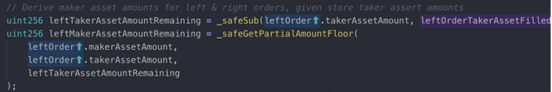

# What is an Audit?

An audit is:  
• An assessment of your secure development process.  
• The best option available to identify subtle vulnerabilities.  
• A systematic method for assessing the quality and security of code.

An opportunity to:  
• Learn from experts  
• Identify gaps in your process  
• Identify underspecified areas of your system

An audit can not:  
• Replace internal quality assurance  
• Overcome excessive complexity or poor architecture  
• Guarantee no bugs or vulnerabilities

## Preparing for an Audit

• We have a finite amount of time to audit your code.  
• Preparation will help you get the most value from us.  
• We must first understand your code, before we can identify subtle vulnerabilities.  
• Imagine we’re a new developer hired to join your team, but we only have a few days to ramp up.

### Steps to prepare

**1. Documentation**

The less time we spend trying to understand your system, the more time we can spend finding bugs.

GOOD DOCUMENTATION:  
Describes the overall system and its objectives  
Describes what should not be possible  
Lists which contracts are derived/deployed, and how they interact with one another

Documenting your code will also help you to improve it.

Example of good documentation: [0x Protocol Specifications](https://github.com/0xProject/0x-protocol-specification/blob/master/v2/v2-specification.md)

**2. Make it easy to run**

Example from [Polymath](https://github.com/PolymathNetwork/polymath-core):

3. Clean up the code

• Add helpful comments: explain the intent, i..e. what are you trying to do

• Using NatSpec \(natural specification\) comments:

• Fix TODOs  
• delete commented out code

4. Run Tools

• [EthLint](https://www.ethlint.com/)  
• [Slither](https://github.com/crytic/slither/issues)  
• MythX

6. Freeze the code

• We can't audit a moving target

## What to expect from an audit

