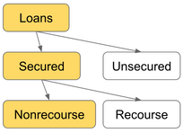

# Price Oracle Manipulation

## **What Are Price Oracles**

On Ethereum, where everything is a smart contract, so too are price oracles. As such, it’s more useful to distinguish between how the price oracle gets its price information. In one approach, you can simply take the existing off-chain price data from price APIs or exchanges and bring it on-chain. In the other, you can calculate the instantaneous price by consulting on-chain decentralized exchanges.


Both options have their respective advantages and disadvantages. Off-chain data is generally slower to react to volatility, which may be good or bad depending on what you’re trying to use it for. It typically requires a handful of privileged users to push the data on-chain though, so you have to trust that they won’t turn evil and can’t be coerced into pushing bad updates. **On-chain data doesn’t require any privileged access and is always up-to-date, but this means that it’s easily manipulated by attackers.**

A further distinction can be made between off-chain and on-chain oracles, that is, whether they are centralized or decentralized.

#### Off-chain Centralized Oracle

This type of oracle simply accepts new prices from an off-chain source, typically an account controlled by the project. Due to the need to quickly update the oracle with new exchange rates, the account is typically an EOA and not a multisig. There may be some sanity checking to ensure that prices don't fluctuate too wildly. [Compound Finance](https://compound.finance/) and [Synthetix](https://www.synthetix.io/) mainly use this type of oracle for most assets

#### Off-chain Decentralized Oracle

This type of oracle accepts new prices from multiple off-chain sources and merges the values through a mathematical function, such as an average. In this model, a multisig wallet is typically used to manage the list of authorized sources. [Maker](https://makerdao.com/feeds/)  and [Chainlink](https://chain.link/) use this type of oracle for ETH and other assets.

#### On-chain Centralized Oracle

This type of oracle determines the price of assets using an on-chain source, such as a **DEX**. However, only a central authority can trigger the oracle to read from the on-chain source. Like an off-chain centralized oracle, this type of oracle requires rapid updates and as such the triggering account is likely an EOA and not a multisig. [dYdX](https://dydx.exchange/) and [Nuo](https://nuo.network/) use this type of oracle for certain assets

#### On-chain Decentralized Oracle

This type of oracle determines the price of assets using an on-chain source, but can be updated by anyone. There may be some sanity checking to ensure that prices don't fluctuate too wildly. [DDEX](https://margin.ddex.io/) uses this type oracle for DAI, while [bZx](https://bzx.network/) uses this type of oracle for all assets.

## “Overcollateralized Loan” Pattern \(DeFi primitive\). **AKA the “nonrecourse loan”.**

This is a very common DeFi primitive used in all kinds of projects: Maker/DAI, Compound, Synthetix, etc. It’s used for decentralized loans, derivatives projects, stable coins, and more. May not be obvious because they use different/custom terminology, e.g.:

* Collateralization ratio
* Collateralized Debt Position \(CDP\)
* Liquidation discount
* Stability fee
* Collateral factor

It is a useful, flexible, and powerful pattern, and it has become quite common. It’s worth learning about if you aren’t already familiar with it.

Before we can talk about decentralized lending however, let's introduce traditional lending. When you take out a loan, you typically need to provide some sort of collateral so that if you default on your loan, the lender can then seize the collateral.

Loans come in two flavors: Unsecured loans and secured loans.

* **Secured Loans**: Loans where the borrower is required to put down some amount of collateral. For example: mortgage loans, trading stocks on margin, pawn shop loans, car loans.
* **Collateral**: Any asset owned by the borrower used to secure the loan. If the borrower defaults, the collateral and use it to cover any unpaid principal and interest. There may be an additional penalty to the borrower if this has to occur.

**Loan-to-Value \(LTV\) Ratio** is the amount the borrower owes the lender \(principal + interest\) divided by the value of the collateral. Higher LTV ratio is riskier for the lender, i.e. the lower the collateral the higher the LTV.

There are two types of secured loans: Recourse loans and **nonrecourse** loans. Difference is what recourse the lender has if the borrower defaults and the collateral is not enough to cover the loan. I.e. with nonrecourse loans the lender does NOT have any means of pursuing the borrower for the remainder owed.



Almost all loans in the open blockchain space are nonrecourse loans, therefore the lender wants to see very low LTV ratio \(typically 50-60% or lower\). For example, a 50% means that if you wanted to borrow $100 you'd have to deposit $200 \($100 principal + $100 collateral\). 


In DeFi, smart contracts calculate the LTV value using the following LTV formula:

\*\*\*\*$$((# of borrowed tokens) * (borrow token price))  /  ((# of collateral tokens) * (collateral token price))$$

The following table compares the factors responsible for increasing or decreasing the TVL: 

<table>
  <thead>
    <tr>
      <th style="text-align:left">What increases the LTV ratio?</th>
      <th style="text-align:left">What decreases the LTV ratio?</th>
    </tr>
  </thead>
  <tbody>
    <tr>
      <td style="text-align:left">
        <p>Time (due to interest).</p>
        <p>I.e. outstanding borrowed tokens accrue interest over time</p>
      </td>
      <td style="text-align:left">N/A</td>
    </tr>
    <tr>
      <td style="text-align:left">Borrowing more tokens</td>
      <td style="text-align:left">Paying back some borrowed tokens</td>
    </tr>
    <tr>
      <td style="text-align:left">Removing some collateral</td>
      <td style="text-align:left">Adding more collateral tokens</td>
    </tr>
    <tr>
      <td style="text-align:left">Price of borrowed token increases</td>
      <td style="text-align:left">Price of borrowed tokens decreases</td>
    </tr>
    <tr>
      <td style="text-align:left">Price of collateral token decreases</td>
      <td style="text-align:left">Price of collateral tokens increases</td>
    </tr>
  </tbody>
</table>


Basically, the TVL increases when the numerator part of the fraction grows proportionally larger than the denominator \(i.e. borrowed tokens value &gt; collateral tokens value\) and decreases when the opposite happens \(i.e. collateral tokens value &gt; borrowed tokens value\).


## Security considerations

In decentralized lending, the same process occurs as in the "real world" except now the lender is a smart contract that is isolated from the outside world. This means that it can't simply "know" the fair market value \(FMV\) of whatever collateral you're trying to provide, i.e. the FMV of the market value of the token borrowed and the collateral token.

### Getting Fair Market Value of Borrow and Collateral Tokens


#### Manipulated Token's Price Risk

If an attacker can control the price oracle, they can steal all the money. Simply adjust borrow token price up \(or the collateral price down\), which puts borrower in default, then liquidate the collateral for approximately $0. This is usually the case fo on-chain centralized oracles, ie. DEXs, whereby an attacker can use flashloans to manipulate the price of AMMs in order to change the spot price of a token just before the lender smart contract looks it up.

Alternatively, if they can censor or DoS the price oracle they can they can steal money although with less of a discount. This happens in off-chain centralized oracles.

#### Centralization Risk

Should a private key from a privileged account get compromised, the attacker could simply mint collateral token can steal all funds. \(Borrow against the new, diluted collateral tokens before the oracle can reflect the new price\).

#### Arbitrage Risk

Latest reported price is, on average, at least several seconds behind the current “public knowledge” price, which can open up arbitrage opportunities.

In Chainlink, oracles only update every 20 minutes or if the price changes over 0.5%.

#### Speed VS. Security

Currently, there isn't really a known decentralized method of getting trustworthy price info on-chain in a way that is both fast and prohibitively expensive to manipulate. For example. Augur is decentralized and prohibitively expensive to manipulate, but too slow for price updates. Chainlink/Provable are fast, but cheap to manipulate \(simply attack the websites they query\). Therefore, the median of multiple trusted third parties is the de facto “standard”.

Additionally, no two projects using this pattern should ever share a price oracle \(of the “median of trusted parties” variety\); this increases the benefit of exploiting the price oracle without increasing the cost of doing so, reducing economic security.

### Calculating Interest on Borrowed Tokens


#### Fixed-Point Libraries

Calculating interest requires a fixed-point library. Most projects seem to be rolling their own.

#### Truncation Issues \(Division\)

Both when withdrawing and depositing in/from a DeFi protocol, there is a rounding error for defect, due to the division operation that zeros out 1 wei. For example if 1 wei is worth 1000 DAI \(wei\) \(not 1000^18\), then 999 buys nothing because it is less than the minimum ETH unit wei, ie. 999/1000=0.  
To give an example, open your terminal and run the following command:

```text
echo 999/1000 | bc
```

The effect may be exacerbated if the conversion happened between USDT and ETH, as USDT has 6 decimal places an not 18, a non trivial amount. If you multiply that for every investment, all these pennies accumulate and eventually get swiped up whenever the pool gets emptied.

This becomes a serious issue when division is not done last when making internal calculations, the effect is much bigger; always divide last in solidity! This can result in truncating away interest owed by borrower over short time frames. Can result in “interest free loans” for certain classes of attackers.

#### Measuring Time

Computing interest requires measuring time, but how? One way is to use `block.timestamp` which can be manipulated by miners but the risk is not that great. Using `block.number` is worse as it requires assumptions about block time, there is a difficulty bomb, and  ETH2.0 block times are unknown.

### Division by Zero in TVL


When all collateral has been removed, denominator of LTV Ratio is zero. Must be handled correctly. This can occur when liquidating during \(or very near\) the “underwater” state, it can also occur when borrower pulls out remaining collateral after paying back entirety of the loan, or if a malicious/compromised/buggy price oracle reports the collateral token price as zero.

## “Undercollateralized Loan” Pattern \(DeFi primitive\)

Imagine you wanted to bring decentralized lending to the blockchain. Users are allowed to deposit assets as collateral and borrow other assets up to a certain amount determined by the value of the assets they’ve deposited. Let’s assume that a user wants to borrow USD using ETH as collateral, that the current price of ETH is 400 USD, and that the collateralization ratio is 150%.

If the user deposits 375 ETH, they’ll have deposited 150,000 USD of collateral. They can borrow 1 USD for every 1.5 USD of collateral, so they’ll be able to borrow a maximum 100,000 USD from the system.

But of course, on the blockchain it’s not as simple as simply declaring that 1 ETH is worth 400 USD because a malicious user could simply declare that 1 ETH is worth 1,000 USD and then take all the money from the system. As such, it’s tempting for developers to reach for the nearest price oracle shaped interface, such as the current spot price on Uniswap, Kyber, or another decentralized exchange.

At first glance, this appears to be the correct thing to do. After all, Uniswap prices are always roughly correct whenever you want to buy or sell ETH as any deviations are quickly correct by arbitrageurs. However, as it turns out, **the spot price on a decentralized exchange may be wildly incorrect during a transaction as shown in the example below.**

Consider how a Uniswap reserve functions. **The price is calculated based on the amount of assets held by the reserve**, but the assets held by the reserve changes as users trade between ETH and USD. **What if a malicious user performs a trade before and after taking a loan from your platform?**

Before the user takes out a loan, they buy 5,000 ETH for 2,000,000 USD. The Uniswap exchange now calculates the price to be 1 ETH = 1,733.33 USD. Now, their 375 ETH can act as collateral for up to 433,333.33 USD worth of assets, which they borrow. Finally, they trade back the 5,000 ETH for their original 2,000,000 USD, which resets the price. **The net result is that your loan platform just allowed the user to borrow an additional 333,333.33 USD without putting up any collateral.**


This case study illustrates the most common mistake when using a decentralized exchange as a price oracle - **an attacker has almost full control over the price during a transaction** and trying to read that price accurately is like reading the weight on a scale before it’s finished settling. You’ll probably get the wrong number and depending on the situation it might cost you a lot of money.

## Key Takeaways <a id="key-takeaways"></a>

### Don't use an on-chain decentralized oracle without some sort of validation <a id="don-t-use-an-on-chain-decentralized-oracle-without-some-sort-of-validation"></a>

Due to the nature of on-chain decentralized oracles, ensure that you're validating the rate being returned, whether it's by taking the order \(thereby nullifying any gains which may have been realized\), **comparing the rate against known good rates \(in the case of DAI\), or comparing the rate in both directions**.

### Consider the implications of dependencies on third-party projects <a id="consider-the-implications-of-dependencies-on-third-party-projects"></a>

In both cases, DDEX and bZx assumed that Uniswap and Kyber would be a source of accurate price data. However, **an accurate rate for a DEX means that a trade can be made using that rate, while an accurate rate for a DeFi project means that it is close to or equal to the FMV**. In other words, an accurate rate for a DeFi project is an accurate rate for a DEX, but the opposite might not be true.

Furthermore, bZx's second attempt at solving this problem was insufficient due to a misunderstanding in how the Kyber Network internally calculates the exchange rate between two non-ETH tokens.

As such, before introducing a dependency on a third-party project, consider not only whether the project has been audited, but also whether the project's specifications and threat model align with your own. If you have the time, taking an in-depth look at their contracts also doesn't hurt.

## Preventative Techniques

By now, I hope that you’ve learned to recognize the common thread - it's not always obvious that you're using a price oracle and if you don't follow the proper precautions, an attacker could trick your protocol into sending them all of your money. While there’s no one-size-fits-all fix that can be prescribed, here are a few solutions that have worked for other projects in the past. Maybe one of them will apply to you too.

### Shallow Markets, No Diving <a id="shallow-markets-no-diving"></a>

Like diving into the shallow end of a pool, diving into a shallow market is painful and might result in significant expenses which will change your life forever. Before you even consider the intricacies of the specific price oracle you’re planning to use, **consider whether the token is liquid enough to warrant integration with your platform.**

### A Bird in the Hand is Worth Two in the Bush <a id="a-bird-in-the-hand-is-worth-two-in-the-bush"></a>

It may be mesmerizing to see the potential exchange rate on Uniswap, but nothing’s final until you actually click trade and the tokens are sitting in your wallet. Similarly, **the best way to know for sure the exchange rate between two assets is to simply swap the assets directly**. This approach is great because there’s no take-backs and no what-ifs. However, it may not work for protocols such as lending platforms which are required to hold on to the original asset.

### Almost Decentralized Oracles <a id="almost-decentralized-oracles"></a>

One way to summarize the problem with oracles that rely on on-chain data is that they’re a little too up-to-date. If that’s the case, why not introduce a bit of artificial delay? **Write a contract which updates itself with the latest price from a decentralized exchange like Uniswap, but only when requested by a small group of privileged users**. Now even if an attacker can manipulate the price, they can’t get your protocol to actually use it.

This approach is really simple to implement and is a quick win, but there are a few drawbacks - in times of chain congestion you might not be able to update the price as quickly as you’d like, and you’re still vulnerable to sandwich attacks. Also, now your users need to trust that you’ll actually keep the price updated.

### Speed Bumps <a id="speed-bumps"></a>

Manipulating price oracles is a time-sensitive operation because arbitrageurs are always watching and would love the opportunity to optimize any suboptimal markets. If an attacker wants to minimize risk, they’ll want to do the two trades required to manipulate a price oracle in a single transaction so there’s no chance that an arbitrageur can jump in the middle. As a protocol developer, if your system supports it, **it may be enough to simply implement a delay of as short as 1 block between a user entering and exiting your system.**

This would **remove the ability to perform deposits and withdrawals within a single transaction** and therefore, make flash-loan based attacks infeasible. On users’ side, this would mean that during depositing, their tokens will be transferred into Harvest in one transaction. The users would subsequently claim their share in another transaction, ideally inside a different block. This would constitute a UX change and potentially incur a higher, yet still acceptable, gas cost for the depositors.

Of course, this might impact composability and miner collaboration with traders is on the rise. In the future, it may be possible for bad actors to perform price oracle manipulation across multiple transactions knowing that the miner they’ve partnered with will guarantee that no one can jump in the middle and take a bite out of their earnings.

### Uniswap Time-Weighted Average Price \(TWAP\) <a id="time-weighted-average-price-twap-"></a>

Uniswap V2 introduced a TWAP oracle for on-chain developers to use. The [documentation](https://uniswap.org/docs/v2/core-concepts/oracles/) goes into more detail on the exact security guarantees that the oracle provides, but in general for large pools over a long period of time with no chain congestion, the TWAP oracle is highly resistant to oracle manipulation attacks. However, due to the nature of its implementation, it may not respond quickly enough to moments of high market volatility and only works for assets for which there is already a liquid token on-chain.

The Uniswap TWAP oracle is available for any token which has a pair on Uniswap V2 or V3. It allows you to calculate the average price of the asset over some period of time up to a certain extent.

#### When to use

Use the Uniswap TWAP oracle if your token is listed on Uniswap V2 or V3 with sufficient trader activity and liquidity. In other words, it is expected that if there is an arbitrage opportunity, a trader should come and take it in order to rebalance the pool. If this is not the case, then it’s possible for an attacker to skew the price and simply wait for the TWAP to update.

#### Potential risks

You must decide on the time interval to use, which can be tricky. A shorter time interval means that you will see price updates quicker, but also lowers the cost of attack to manipulate the oracle. A longer time interval makes it much harder to manipulate the average price, but also means you won’t be able to react to volatility in the markets.

#### Example implementation

For Uniswap V2, see [GitHub](https://github.com/Uniswap/uniswap-v2-periphery/blob/master/contracts/examples/ExampleOracleSimple.sol) for an implementation of a 24 hour TWAP oracle.

For Uniswap V3, see [GitHub](https://github.com/Uniswap/uniswap-v3-periphery/blob/main/contracts/libraries/OracleLibrary.sol) for a library which you can integrate into your project.


Related: [https://shouldiusespotpriceasmyoracle.com/](https://shouldiusespotpriceasmyoracle.com/)


### Curve Virtual Price

#### Overview

Curve pools provide a function to calculate the price of a single LP token in a flash loan resistant manner.

#### When to use

If you need to calculate the price of Curve LP shares, then use the `get_virtual_price` function.

#### Potential risks

No additional risks besides dependency risk for every token the Curve pool supports.

#### Example implementation

See Curve’s [documentation](https://github.com/curvefi/curve-contract/blob/master/integrations.md#bonus-measuring-profits) for more info.

### Maker Price Feed

#### Overview

Maker operates their own network of price feeds which exposes data to whitelisted contracts on-chain. Projects can apply for access to the price data through the Maker governance process.

#### When to use

Use Maker’s price feeds if you think you can make it through the governance process and you would prefer to offload your oracle risks to the Maker oracle team.

#### Potential risks

You need to trust the Maker team and the anonymous feeds to behave correctly. However, the risk is low in practice given that Maker itself depends on these oracles. Also, as feed operators need to submit prices on chain manually, prices may be delayed during periods of extremely high chain congestion.

#### Example implementation

Submit a [MIP10c9 subproposal](https://github.com/makerdao/mips/blob/master/MIP10/MIP10c9-Subproposal-Template.md) to [Maker Governance](https://forum.makerdao.com/c/core-units/oracles/13)

### M-of-N Reporters <a id="m-of-n-reporters"></a>

Sometimes they say that if you want something done right, you do it yourself. What if you gather up N trusted friends and ask them to submit what they think is the right price on-chain, and the best M answers becomes the current price?

This approach is used by many large projects today: Maker runs a set of [price feeds](https://developer.makerdao.com/feeds/) operated by trusted entities, Compound created the [Open Oracle](https://medium.com/compound-finance/announcing-compound-open-oracle-development-cff36f06aad3) and features reporters such as [Coinbase](https://blog.coinbase.com/introducing-the-coinbase-price-oracle-6d1ee22c7068), and **Chainlink aggregates price data from Chainlink operators and exposes it on-chain.** Just keep in mind that if you choose to use one of these solutions, you’ve now delegated trust to a third party and your users will have to do the same. Requiring reporters to manually post updates on-chain also means that during times of high market volatility and chain congestion, price updates may not arrive on time.

#### Chainlink

Chainlink supports over 100 price feeds on Ethereum mainnet, mainly for pairs with ETH and pairs with USD. Developers can access this data for free simply by querying the smart contracts when needed.

#### When to use

Use Chainlink if you need pricing data for an asset that Maker or Uniswap doesn’t support, or if the latency associated with a TWAP oracle is unacceptable to your project.

#### Potential risks

Similar to Maker, you’ll need to trust the Chainlink team and node operators to behave correctly. Chainlink also requires node operators to push values on chain, so it may also suffer delays during periods of high chain congestion.

#### Example implementation

Refer to the [Chainlink documentation](https://docs.chain.link/docs/get-the-latest-price/) for an example of how to get the price from a Chainlink aggregator smart contract.

### **A stricter configuration of the existing deposit arb check in the strategies**

A stricter threshold ****that sets a maximum price fluctuation can make such an attack economically infeasible, however, it may be limiting deposits in the case of a natural impermanent loss effects. 

### **Withdrawals in an underlying asset**

When users deposit into vaults that use share pools \(such as the Y pool\), they effectively trade their single asset for the pool asset \(such as the yCurve\). If the users withdrew only the underlying asset, they would be able to trade them for an asset combination as per the current market conditions. If the market was manipulated, the trade would be also subject to such manipulation, which would prevent the attacking entity from generating a profit. From a regular user’s perspective, withdrawing yCRV could be followed by conversion into a stablecoin in a separate transaction. While this requires a UX change, this could also address the social slippage problem, and thus could be beneficial for the protocol. The disadvantage of this approach is that it binds the vault withdrawal mechanism to the strategy that is currently being used: if a strategy is switched to another strategy that does not use the shared underlying pool, or uses a different pool, the asset produced by the withdrawal would change too.

### **Using oracles for determining asset price**

While an approximate asset price may be effectively determined from external oracles \(provided by Chainlink or Maker\), it would have a very loose connection to the real share price. If the value of assets inside the underlying DeFi protocol differed from the value reported by the oracle, the vault would be exposed to free arbitrage and a flashloan attack. This is not a solution for Harvest, however, oracles will be considered in the system design and possible mitigation strategies \(as they have been considered up to this point\).

## FAQ <a id="faq"></a>

### OK, but why shouldn’t I use spot price in the first place? <a id="ok-but-why-shouldnt-i-use-spot-price-in-the-first-place"></a>

Good question. It depends on what you’re using the spot price for, although odds are you probably want to use it to calculate the price of some asset that users are depositing onto your platform. This means that it’s crucial to ensure that the user can’t just lie to you about how much the asset is really worth.

Unfortunately, spot price by definition changes whenever someone buys or sells the asset. This means an attacker can easily make the apparent value much higher or much lower than the true value of the asset. For a protocol which uses the price to calculate the borrowing power of a user, artifically inflating the value of an asset being deposited as collateral means the entire protocol can be \(and will be, as numerous hacks have shown\) completely drained.

### How do I tell if I’m using spot price? <a id="how-do-i-tell-if-im-using-spot-price"></a>

A good question! It turns out it might not be immediately obvious if you’re using spot price or not.

Let’s imagine that you want to find the price of WBTC in ETH. A seemingly obvious solution is to take the Uniswap V2 pair for ETH/WBTC, grab the reserve balance of ETH and WBTC, then divide the two. However, you’ve just calculated the spot price, and an attacker can easily manipulate it by buying or selling into the pool.

That seems fairly straightforward, but what if you actually want to calculate the price of a single ETH/WBTC LP token? It may be tempting to calculate the USD value of ETH and WBTC in order to calculate the total USD value of the pool. However, by doing this you’re actually incorporating the spot price because you’re still dependent on the reserve balances of the pool. This is an extremely subtle detail, and more than one project has been caught by it. You can read more about this footgun in this [writeup](https://cmichel.io/pricing-lp-tokens/) by [@cmichelio](https://twitter.com/cmichelio).

## Resources

* [https://samczsun.com/so-you-want-to-use-a-price-oracle/](https://samczsun.com/so-you-want-to-use-a-price-oracle/)
* [https://samczsun.com/taking-undercollateralized-loans-for-fun-and-for-profit/](https://samczsun.com/taking-undercollateralized-loans-for-fun-and-for-profit/)
* [https://shouldiusespotpriceasmyoracle.com/](https://shouldiusespotpriceasmyoracle.com/)
* [https://ethereum.org/en/developers/docs/oracles/](https://ethereum.org/en/developers/docs/oracles/)
* [https://docs.uniswap.org/protocol/concepts/V3-overview/oracle](https://docs.uniswap.org/protocol/concepts/V3-overview/oracle)
* [https://blog.trailofbits.com/2020/08/05/accidentally-stepping-on-a-defi-lego/](https://blog.trailofbits.com/2020/08/05/accidentally-stepping-on-a-defi-lego/)
* [https://www.palkeo.com/en/projets/ethereum/bzx.html](https://www.palkeo.com/en/projets/ethereum/bzx.html)
* [https://medium.com/harvest-finance/harvest-flashloan-economic-attack-post-mortem-3cf900d65217](https://medium.com/harvest-finance/harvest-flashloan-economic-attack-post-mortem-3cf900d65217)
* [https://forum.openzeppelin.com/t/introduction-to-the-overcollateralized-loan-pattern-defi-primitive-and-its-security-considerations/2141](https://forum.openzeppelin.com/t/introduction-to-the-overcollateralized-loan-pattern-defi-primitive-and-its-security-considerations/2141)
* [https://www.youtube.com/watch?v=YGO7nzpXCeA&t=1033s](https://www.youtube.com/watch?v=YGO7nzpXCeA&t=1033s)
* [https://docs.google.com/presentation/d/1pRH3DN-nchKpqVi2xc6osLhbhk9q9USKePPmUHyJHqo/edit](https://docs.google.com/presentation/d/1pRH3DN-nchKpqVi2xc6osLhbhk9q9USKePPmUHyJHqo/edit)
* [The “Overcollateralized Loan” Pattern .ppt](https://docs.google.com/presentation/d/1pRH3DN-nchKpqVi2xc6osLhbhk9q9USKePPmUHyJHqo/edit#slide=id.p)
* [Computing and Accumulating Interest On-chain .ppt](https://docs.google.com/presentation/d/1c_HXwpuzFYRLb8gU7YgWvnNFE2eQIAcbJ7Pc8dPq9_0/edit#slide=id.p)

#### Oracles

* [https://makerdao.world/en/faqs/oracles/](https://makerdao.world/en/faqs/oracles/)
* [https://docs.uniswap.org/protocol/concepts/V3-overview/oracle](https://docs.uniswap.org/protocol/concepts/V3-overview/oracle)
* [https://ethereum.org/en/developers/docs/oracles/](https://ethereum.org/en/developers/docs/oracles/)

